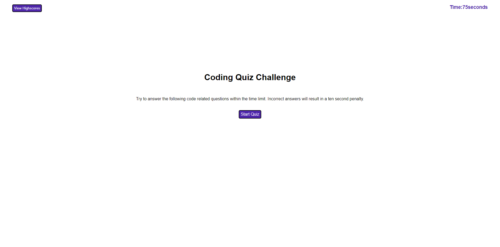
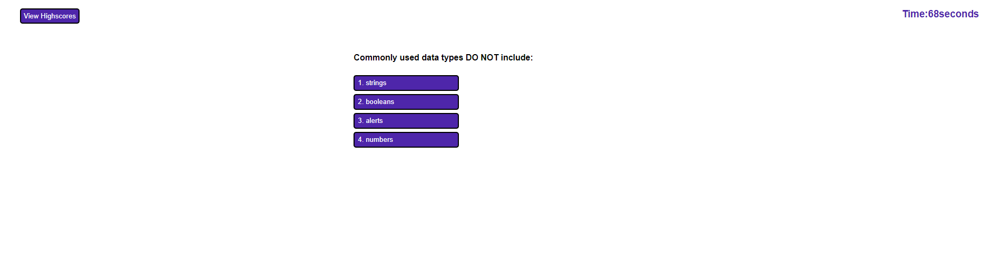
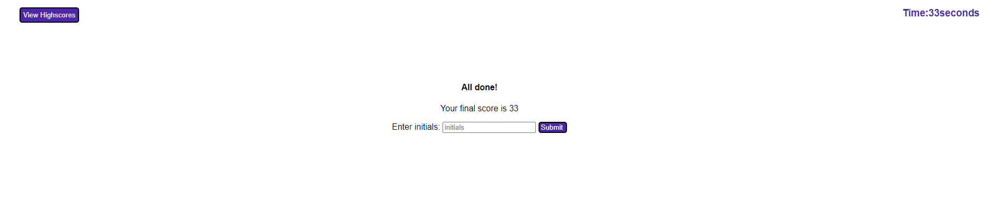
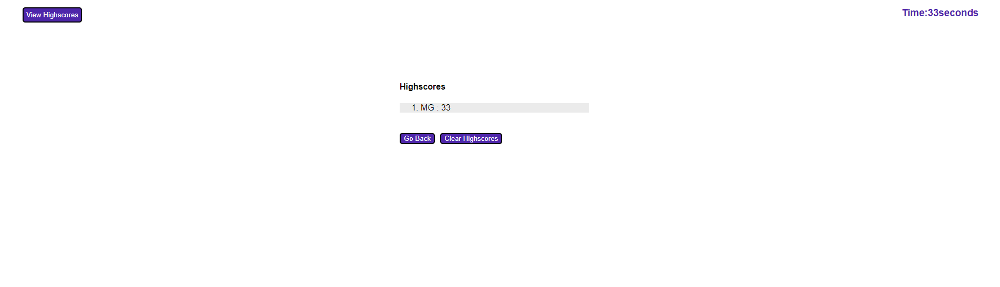

# Week4 Javascript Code Quiz 

### By Mackenzie Gray   

## Technologies Used

- Javascript 
- HTML
- CSS

## Description 

The motivation for this project was to develop a simple timed quiz on Javascript fundamentals that allows users to log their scores once the quiz is completed so that the scores can be easily compared to other users. 

## Outline of CodeBase Writing 

HTML:
- Writing of codebase for page content including text for landing page, buttons for highscore and section including the time countdown. 
- Writing of template for question content to be added dynamically later with javascript for question and answer content.
- Linking the CSS in the head section of the page.
- Linking the JavaScript in the  bottom of the body section of the page. 

CSS:
- General styling of the page such as font family and colour of buttons.
- Inclusion of flex box properties to align the question and answer sections to the center of the page.
- Hiding elements of the page initially to be shown later on the page through Javascript. 

Javascript:
- Writing of variables including query selectors for buttons, timer elements and highscore elements.
- Writing of question array. 
- Developing functions such as starting the quiz, starting the timer, cycling the question, checking the answer, adding/logging/showing the score and clearing the score. 
- Adding event listeners to buttons such as start quiz, buttons for answers in questions, submit button, back button and view highscore button. 

## Website URL and
[Click here to view website](https://mdkgray.github.io/Week4_Javascript_API_Quiz/)

## Screenshots

